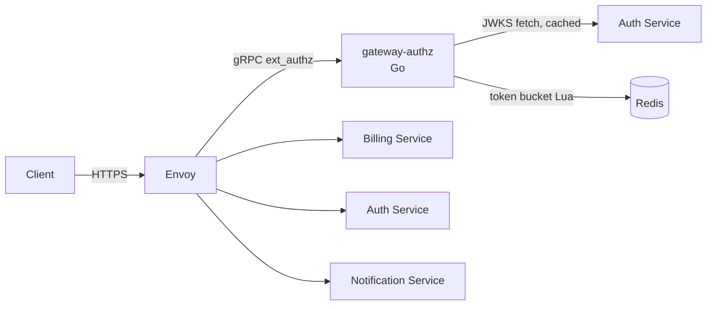

# API Gateway

## Overview
The API Gateway is the single public entry point for `api.lumen.io`. Envoy terminates TLS and routes traffic. A Go ext-authz filter (`gateway-authz`) validates JWTs and applies per-tenant rate limits before any request reaches a backend. Owned by Platform ([Priya Nair](../people/priya-nair.md)).

## Key Architecture & Responsibilities

- **JWT validation** — verifies signature against the cached JWKS from [Auth Service](auth-service.md), plus `iss`, `aud`, and `exp` with 30s leeway. Cache rules are in [JWT Session Tokens](../concepts/jwt-session-tokens.md).
- **Rate limiting** — per-tenant token buckets in [Redis](redis.md). See [Gateway Rate Limiting](../features/gateway-rate-limiting.md).
- **Header injection** — forwards `x-lumen-tenant-id`, `x-lumen-user-id`, and `x-request-id`. Backends trust these headers only from the gateway, never from clients.
- **Config** — Envoy routes live in `deploy/gateway/envoy.yaml`. Rate-limit overrides are LaunchDarkly flags.

### Invariants
- Backends are never exposed publicly. All ingress goes through the gateway.
- Rate limiting **fails open** if Redis is unavailable or the call exceeds 5 ms, and increments `gateway.ratelimit.fail_open`.

## Related Concepts & Dependencies
- Journeys: [User Login Flow](../systems/user-login-flow.md), [Checkout Journey](../systems/checkout-journey.md)
- Runbook: [Debugging 401 Unauthorized](../runbooks/debugging-401-unauthorized.md)
- Principles: [Service Boundaries](../concepts/service-boundaries.md)

## Change History & Superseded Decisions
- **2026-10-01**: Page created. Includes the rate-limiting rollout and the JWKS cache-refresh-on-unknown-`kid` fix that followed the 2026-09-18 401 spike.
