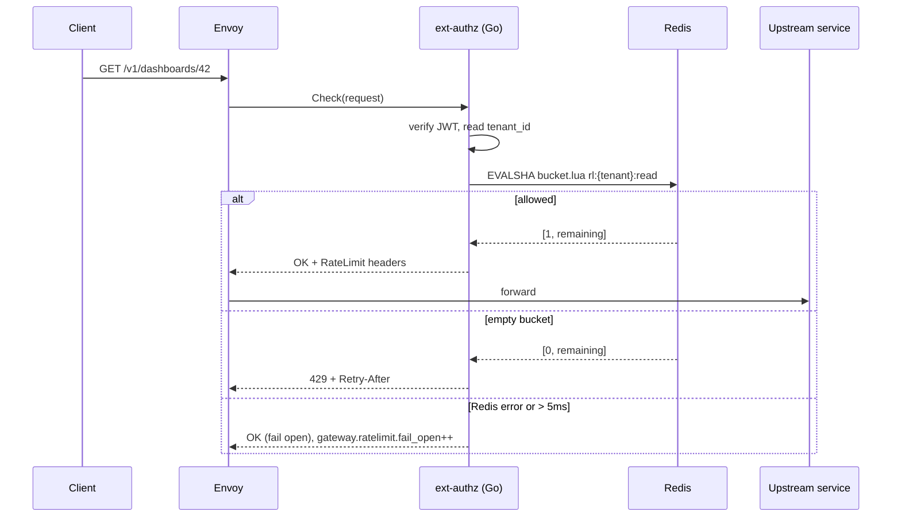

# Gateway Rate Limiting

## Overview
Per-tenant, cluster-wide rate limiting in the [API Gateway](../entities/api-gateway.md). A token bucket per `(tenant_id, route_class)` lives in [Redis](../entities/redis.md) and is evaluated by the Go ext-authz filter — the same filter that validates JWTs, so `tenant_id` is already available from token claims. Fails **open** when Redis is unavailable.

| | |
|---|---|
| **Owner** | [Priya Nair](../people/priya-nair.md) (Platform) |
| **Ticket** | PLT-317 |
| **PRs** | #1474, #1481 |
| **Overrides flag** | `gateway-rate-limits` (LaunchDarkly, JSON) |

> [!note] Trigger
> On 2026-09-02 tenant `ten_Zk91` hit `/v1/reports/export` at ~3k rps and degraded p99 latency for all tenants. The previous Envoy local rate limit was per-pod and not tenant-aware.

## Key Architecture & Responsibilities

### Route classes and defaults (`gateway-routes.yaml`)

| Class | Examples | Rate | Burst | Keyed by |
|---|---|---|---|---|
| `read` | `GET /v1/dashboards/*` | 50 rps | 100 | tenant |
| `write` | `POST`/`PUT`/`PATCH` | 10 rps | 20 | tenant |
| `export` | `/v1/reports/export` | 1 rps | 3 | tenant |
| `auth` | `/v1/auth/*` | 5 rps | 10 | client IP (no token yet) |

Per-plan or per-tenant overrides are set in the LaunchDarkly flag so Sales/CS can raise limits without a deploy:

```json
{
  "plans":   { "enterprise": { "read": { "rate": 200, "burst": 400 } } },
  "tenants": { "ten_8Hq2":   { "export": { "rate": 5, "burst": 10 } } }
}
```

### Request path



### Token bucket script

```lua
-- KEYS[1] = rl:{tenant}:{class}
-- ARGV: rate (tokens/s), burst, now_ms, cost
local rate, burst = tonumber(ARGV[1]), tonumber(ARGV[2])
local now, cost   = tonumber(ARGV[3]), tonumber(ARGV[4])

local b = redis.call('HMGET', KEYS[1], 'tokens', 'ts')
local tokens = tonumber(b[1]) or burst
local ts     = tonumber(b[2]) or now

tokens = math.min(burst, tokens + math.max(0, now - ts) / 1000 * rate)
local allowed = tokens >= cost
if allowed then tokens = tokens - cost end

redis.call('HSET', KEYS[1], 'tokens', tokens, 'ts', now)
redis.call('PEXPIRE', KEYS[1], math.ceil(burst / rate * 1000) + 1000)
return { allowed and 1 or 0, tostring(tokens) }
```

The script is loaded with `SCRIPT LOAD` at gateway startup and called with `EVALSHA`. `now_ms` is supplied by the gateway (NTP-synced pods); clock skew of a few ms is irrelevant for a bucket.

### Response headers (IETF `RateLimit` draft)

```
RateLimit-Policy: 50;w=1;burst=100
RateLimit: limit=50, remaining=37, reset=1
Retry-After: 1          # 429 only
```

### Failure mode
If Redis is unreachable or the call exceeds **5 ms**, the request is allowed and `gateway.ratelimit.fail_open` is incremented. Agreed with SRE ([Dan Kowalski](../people/dan-kowalski.md)): a Redis blip must never become a full outage.

### Load test (k6, staging, 6 gateway pods)

| Scenario | RPS | p50 added | p99 added | 429 accuracy |
|---|---|---|---|---|
| Baseline (no RL) | 12,000 | — | — | — |
| RL on, 500 tenants | 12,000 | +0.4 ms | +1.8 ms | 99.6% |
| RL on, 1 hot tenant @ 3k rps | 12,000 | +0.4 ms | +2.1 ms | 99.9% |
| Redis failover mid-test | 12,000 | +0.5 ms | +5.0 ms (fail open 11 s) | n/a |

### Alternatives rejected
- **`envoyproxy/ratelimit` global service** — fixed-window only and one more service to operate; ext-authz already makes a network hop per request.

## Related Concepts & Dependencies
- [API Gateway](../entities/api-gateway.md), [Redis](../entities/redis.md)
- [JWT Session Tokens](../concepts/jwt-session-tokens.md) — source of `tenant_id`; the same PR series changed JWKS caching (#1491)
- [Debugging 401 Unauthorized](../runbooks/debugging-401-unauthorized.md) — 429s and 401s both originate in ext-authz

## Change History & Superseded Decisions
- **2026-09-24**: Initial per-tenant limiting shipped (`2026-09-24-gateway-rate-limiting.md`). Supersedes the per-pod Envoy local rate limit as the primary protection (local limit kept as a coarse backstop).
- **Open**: per-tenant `gateway.ratelimit.rejected` dashboard for CS; document LD flag schema.
