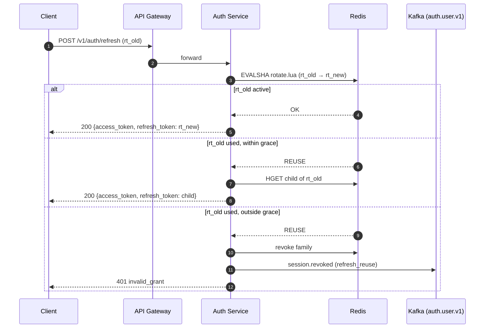

# Refresh Token Rotation

## Overview
Every call to `POST /v1/auth/refresh` on the [Auth Service](../entities/auth-service.md) returns a **new** refresh token and invalidates the presented one. Tokens belong to a *family* (one per login session); presenting an already-used token outside a short grace window is treated as theft and revokes the whole family. Shipped to 100% of production on 2026-09-22.

| | |
|---|---|
| **Owner** | [Alice Chen](../people/alice-chen.md) (Identity) |
| **Tickets** | IDN-482, IDN-488 |
| **PRs** | #1432, #1437, #1441, #1495, #1502 |
| **Flag** | `auth-refresh-rotation` (LaunchDarkly) — permanently on |
| **Status** | Live; legacy non-rotating path removed after 2026-10-22 |

> [!note] Why
> Before this change, refresh tokens were opaque, reusable and valid for 30 days. A single leaked token granted a month of silent access. The August 2026 security review rated this P1.

## Key Architecture & Responsibilities

### Token family model
- On login, auth-service creates a `family_id` (UUIDv7) and the first refresh token in it.
- Token format: `rt_<base64url(32 random bytes)>`. Only `sha256(token)` is ever stored.
- On refresh: if the presented token is `active`, mark it `used`, mint a child in the same family, return the child.
- If the presented token is already `used`:
  - **within grace** (same `client_id`, rotated < grace window ago) → return the already-minted child (handles two browser tabs refreshing concurrently).
  - **outside grace** → *reuse detected* → revoke the family and emit `session.revoked` (`reason=refresh_reuse`) on `auth.user.v1` via [Kafka](../entities/kafka.md).



### Redis key schema ([Redis](../entities/redis.md), ElastiCache cluster mode)

| Key | Type | Fields | TTL |
|---|---|---|---|
| `rt:{fid}:{sha256}` | HASH | `family_id`, `user_id`, `status`, `issued_at`, `parent`, `child`, `used_at` | 30d |
| `rtfam:{fid}` | HASH | `user_id`, `client_id`, `status`, `created_at`, `last_rotated_at` | 30d sliding |
| `rtfam:{fid}:tok` | SET | token hashes in family (for revoke-all) | 30d sliding |

> [!warning] Hash tags are mandatory
> All keys for a family share the `{fid}` hash tag so the rotate script touches a single cluster slot. Without it, ElastiCache returns `CROSSSLOT` errors.

Rotation is a single Lua script so concurrent refreshes cannot both succeed:

```lua
-- KEYS: rt:{fid}:{old}, rt:{fid}:{new}, rtfam:{fid}, rtfam:{fid}:tok
local status = redis.call('HGET', KEYS[1], 'status')
if status == false then return redis.error_reply('NOT_FOUND') end
if redis.call('HGET', KEYS[3], 'status') == 'revoked' then return redis.error_reply('REVOKED') end
if status == 'used' then return redis.error_reply('REUSE') end
redis.call('HSET', KEYS[1], 'status', 'used', 'child', ARGV[6], 'used_at', ARGV[3])
-- ... create KEYS[2], SADD to family set, refresh TTLs
return 'OK'
```

### Durable audit (Postgres `auth_db`)
Redis is the source of truth for liveness; [Postgres](../entities/postgres.md) stores families for the "active sessions" UI and forensics. Writes are asynchronous via a bounded channel; overflow increments `auth.refresh.audit_dropped`.

```sql
CREATE TABLE refresh_token_families (
  family_id     uuid PRIMARY KEY,
  user_id       uuid NOT NULL REFERENCES users(id),
  client_id     text NOT NULL,
  created_at    timestamptz NOT NULL DEFAULT now(),
  revoked_at    timestamptz,
  revoke_reason text CHECK (revoke_reason IN ('logout','refresh_reuse','admin','password_change'))
);
CREATE INDEX ON refresh_token_families (user_id) WHERE revoked_at IS NULL;
```

### Configuration

```yaml
# deploy/auth-service/values-prod.yaml
refresh:
  ttl: 720h
  reuseGrace:
    default: 10s
    ios-app: 30s       # iOS background refresh can be delayed
    android-app: 30s
```

### Invariants
- Password change revokes **all** families for the user (#1495).
- The gateway does not dedupe or inspect refresh tokens — token semantics stay inside auth-service per [Service Boundaries](../concepts/service-boundaries.md).

### Rollout history

| Date | Stage |
|---|---|
| 2026-09-09 | Staging 100% |
| 2026-09-11 | Prod 5% |
| 2026-09-15 | Prod 25% |
| 2026-09-22 | Prod 100% |
| 2026-10-22 | Legacy (family-less) token path removed (#1502) |

### Metrics (Datadog)
- `auth.refresh.rotated` — count
- `auth.refresh.reuse_detected` — count, tag `within_grace:true|false`. Baseline ~40/day, ~92% within grace.
- `auth.refresh.latency` — p99 ≈ 11 ms (Postgres-only prototype was 31 ms, which is why Redis is the hot path)
- `auth.refresh.audit_dropped` — should be 0

## Related Concepts & Dependencies
- [JWT Session Tokens](../concepts/jwt-session-tokens.md) — access tokens and JWKS key rotation
- [User Login Flow](../systems/user-login-flow.md) — where families are created
- [Debugging 401 Unauthorized](../runbooks/debugging-401-unauthorized.md) — first stop when users get logged out
- Services: [Auth Service](../entities/auth-service.md), [API Gateway](../entities/api-gateway.md), [Redis](../entities/redis.md)

## Change History & Superseded Decisions
- **2026-09-26**: Per-client grace windows; password change revokes all families (`2026-09-26-jwks-key-rotation-followup.md`).
- **2026-09-12**: Initial implementation. Supersedes reusable 30-day opaque refresh tokens. Postgres-only design rejected for latency (`2026-09-12-refresh-token-rotation.md`).
