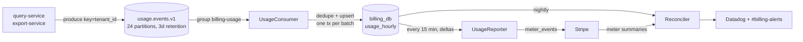

# Usage-Based Billing

## Overview
Metered billing for the **Analytics Pro** plan: a base fee plus $0.002 per dashboard query and $0.50 per GB exported. Product services emit usage events to `usage.events.v1`; the [Billing Service](../entities/billing-service.md) deduplicates and aggregates them hourly, reports deltas to [Stripe](../entities/stripe-api.md) Billing Meters, and reconciles nightly.

| | |
|---|---|
| **Owner** | [Marcus Obi](../people/marcus-obi.md) (Billing) |
| **Epic** | BIL-210 |
| **RFC** | [Usage-based billing RFC](../../raw/rfcs/2026-09-05-rfc-usage-based-billing.md) (Accepted 2026-09-05) |
| **PRs** | #1450, #1458, #1463, #1470 |
| **Status** | Consumer + reporter live; reconciliation in prototype |

## Key Architecture & Responsibilities

### Pipeline



### Event contract — `usage.events.v1` (schema_version 1)

| Field | Type | Notes |
|---|---|---|
| `event_id` | UUIDv7 | **Required.** Global dedupe key, set by the producer |
| `tenant_id` | string | `ten_*` — also the Kafka partition key |
| `metric` | enum | `dashboard.query`, `export.bytes` |
| `quantity` | int64 | count or bytes |
| `occurred_at` | RFC3339 | producer clock |
| `schema_version` | int | `1` |

> [!warning] Correctness depends on producers
> Kafka delivery is at-least-once. If a producer regenerates `event_id` on retry, the customer is double-billed. See [Idempotency Keys](../concepts/idempotency-keys.md).

### Data model (`billing_db`)

```sql
CREATE TABLE usage_hourly (
  tenant_id          text        NOT NULL,
  metric             text        NOT NULL,
  hour               timestamptz NOT NULL,
  quantity           bigint      NOT NULL DEFAULT 0,
  reported_quantity  bigint      NOT NULL DEFAULT 0,
  PRIMARY KEY (tenant_id, metric, hour)
);

-- daily partitions, dropped after 7 days (> 3d Kafka retention)
CREATE TABLE usage_events_seen (
  event_id uuid        NOT NULL,
  seen_at  timestamptz NOT NULL,
  PRIMARY KEY (event_id, seen_at)
) PARTITION BY RANGE (seen_at);

CREATE TABLE usage_late_events ( /* events > 35 days old; manual invoice adjustment */ );
```

### Deduplication
Dedupe and aggregation happen **in the same transaction**, so a crash can never count an event without marking it seen (or vice versa). An in-memory LRU was tried first and failed on consumer-group rebalances.

```ts
await this.db.transaction(async (tx) => {
  const seen = await tx.query(
    `INSERT INTO usage_events_seen (event_id, seen_at) VALUES ($1, now())
     ON CONFLICT DO NOTHING RETURNING event_id`, [evt.event_id]);
  if (seen.rowCount === 0) return; // duplicate
  await tx.query(
    `INSERT INTO usage_hourly (tenant_id, metric, hour, quantity)
     VALUES ($1, $2, date_trunc('hour', $3::timestamptz), $4)
     ON CONFLICT (tenant_id, metric, hour)
     DO UPDATE SET quantity = usage_hourly.quantity + EXCLUDED.quantity`,
    [evt.tenant_id, evt.metric, evt.occurred_at, evt.quantity]);
});
```

In production the consumer uses kafkajs `eachBatch` with one transaction per 500 messages and multi-row inserts (~600 → ~9,000 msg/s per pod). Offsets are committed only after the transaction commits.

### Reporting to Stripe
- `UsageReporter` runs every 15 min, selects rows where `reported_quantity < quantity`, and sends the **delta** as a meter event.
- Stripe idempotency `identifier` = `{tenant}:{metric}:{hour}:{reported_quantity}` — retries of the same delta are no-ops; later deltas for the same hour get a new identifier.
- Stripe rejects events > 35 days old or > 5 min in the future. Old events go to `usage_late_events`.
- One Stripe Meter per metric: `lumen_dashboard_query`, `lumen_export_bytes`.

### Reconciliation
Nightly job compares `sum(usage_hourly.quantity)` against Stripe meter event summaries per tenant and posts drift to Datadog and `#billing-alerts`. Finance requirement: drift < 0.1%. Alert threshold not finalized (prototype #1470).

### Operational notes
- A backfill by the analytics team on 2026-09-16 put the consumer 2M messages behind; it recovered in ~40 min after scaling to 6 pods. See [Kafka Consumer Lag](../runbooks/kafka-consumer-lag.md).
- Billing-service is only a *consumer* here, so the [Transactional Outbox](../concepts/transactional-outbox.md) decision does not change this pipeline.

## Related Concepts & Dependencies
- [Idempotency Keys](../concepts/idempotency-keys.md)
- [Checkout Journey](../systems/checkout-journey.md) — where metered prices are attached at plan upgrade
- [Service Boundaries](../concepts/service-boundaries.md) — why producers don't aggregate
- Infrastructure: [Kafka](../entities/kafka.md), [Postgres](../entities/postgres.md), [Stripe API](../entities/stripe-api.md)
- Local testing: [Stripe Webhooks Locally](../guides/stripe-webhooks-locally.md)

## Change History & Superseded Decisions
- **2026-09-19**: Batched consumer, Stripe delta reporting and reconciliation prototype documented (`2026-09-19-usage-metering-pipeline.md`). In-memory LRU dedupe superseded by `usage_events_seen` table.
- **2026-09-05**: RFC accepted. Direct-to-Stripe, producer-side aggregation and third-party metering vendors rejected (`2026-09-05-rfc-usage-based-billing.md`).
