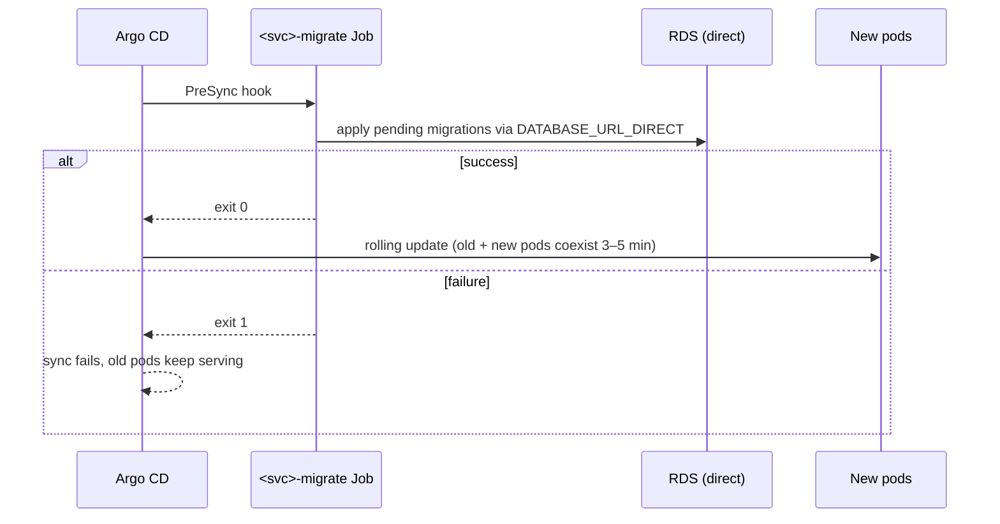

# Database Migrations

## Overview
Each stateful service owns its schema and its migration tool (see [Service Boundaries](../concepts/service-boundaries.md)). Migrations run automatically in production as an Argo CD PreSync job before new pods roll out. Because old and new application versions always run side by side during a rollout, **every migration must follow the expand/contract pattern**.

## Tooling per Service

| Service | Tool | Location | Create | Apply |
|---|---|---|---|---|
| [Auth Service](../entities/auth-service.md) | goose (SQL) | `services/auth-service/migrations/` | `make -C services/auth-service migrate-new name=<name>` | `make -C services/auth-service migrate-up` |
| [Billing Service](../entities/billing-service.md) | Prisma Migrate | `services/billing-service/prisma/migrations/` | `npx prisma migrate dev --name <name>` | `npx prisma migrate deploy` |
| [Notification Service](../entities/notification-service.md) | Alembic | `services/notification-service/alembic/versions/` | `uv run alembic revision --autogenerate -m "<msg>"` | `uv run alembic upgrade head` |
| [API Gateway](../entities/api-gateway.md) | — | stateless | — | — |

Locally, `make migrate` applies all of them; `make db-reset` drops, re-creates, migrates, and re-seeds both local databases.

## How Migrations Run in Production



> [!warning] Bypass PgBouncer for migrations
> Migration jobs connect **directly to RDS** via `DATABASE_URL_DIRECT`. Prisma Migrate and goose rely on advisory locks and session state that break under PgBouncer transaction mode. See [Postgres](../entities/postgres.md).

## The Expand / Contract Rule

Old pods keep running during the rollout and after any Argo rollback (rollback reverts the app, **not** the schema). A migration must therefore be compatible with both the previous and the current release.

Example: renaming `invoices.amount` → `invoices.amount_cents`:

| Step | Release | Schema change | App behaviour |
|---|---|---|---|
| 1. Expand | N | Add `amount_cents` (nullable) | Write both columns, read `amount` |
| 2. Backfill | — | Batched job (5k rows, sleep between batches) | — |
| 3. Switch | N+1 | Add `NOT NULL` once backfill verified | Read `amount_cents`, write both |
| 4. Contract | N+2 or later | Drop `amount` | Write only `amount_cents` |

### Never in a single migration
- Rename a column or table.
- Drop a column still read by the currently deployed release.
- Add `NOT NULL` without a default to a large table.
- `CREATE INDEX` without `CONCURRENTLY` on large tables (`invoices`, `usage_events`, `refresh_tokens`) — it blocks writes.

### Concurrent indexes

```sql
-- goose
-- +goose NO TRANSACTION
-- +goose Up
CREATE INDEX CONCURRENTLY IF NOT EXISTS idx_refresh_tokens_family
  ON refresh_tokens (family_id);
```

Prisma cannot emit `CONCURRENTLY`. Create the migration with `npx prisma migrate dev --create-only`, replace the generated SQL by hand, and add a `-- manual: concurrent index` comment so reviewers know it was edited.

> [!tip]
> Keep long-running work (backfills, external API calls) out of migration transactions. The 2026-09-29 incident showed how open transactions exhaust connection pools — see [Postgres Connection Pool Exhaustion](../runbooks/postgres-connection-pool-exhaustion.md).

## Rollback Policy

- **Production: roll forward only.** Down migrations are never run in prod. If a migration is wrong, ship a new migration that corrects it.
- Down migrations exist for local development convenience only.
- Argo CD rollback reverts application code; this is safe only because of expand/contract.

## Review Checklist
- [ ] Compatible with the previous release's code?
- [ ] Any index on a large table uses `CONCURRENTLY`?
- [ ] No rename/drop of in-use columns?
- [ ] Backfill is batched and outside the migration?
- [ ] Tested with `make db-reset` locally?

## Related Concepts & Dependencies
- [Postgres](../entities/postgres.md)
- [Service Boundaries](../concepts/service-boundaries.md)
- [Local Development Environment](local-dev-environment.md)
- [Postgres Connection Pool Exhaustion](../runbooks/postgres-connection-pool-exhaustion.md)

## Change History & Superseded Decisions
- **2026-10-01**: Created from `raw/how-to/2026-09-22-marcus-db-migrations.md`, prompted by BILL-1190 (a single-step column rename that would have broken rollout). Formalised expand/contract and roll-forward-only policy.
