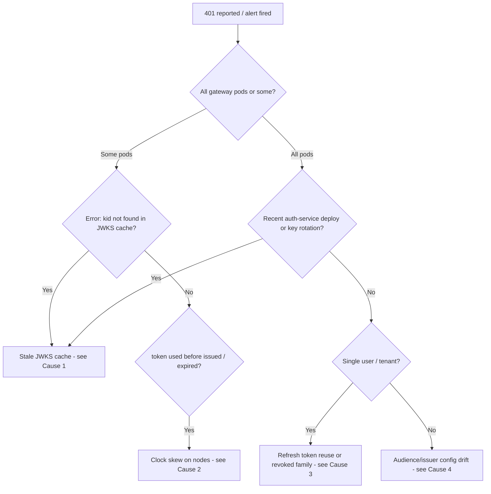

# Runbook: Debugging 401 Unauthorized

## Overview
All authentication is enforced at the [API Gateway](../entities/api-gateway.md) by the Go ext-authz filter, which verifies JWTs minted by the [Auth Service](../entities/auth-service.md) against the auth JWKS. A spike in 401s is almost always a mismatch between **what the token says** and **what the gateway believes** (keys, clocks, audience). Use this runbook for both the `gateway.authz.denied rate > 5%` alert and individual "I keep getting logged out" reports.

## Triage Decision Tree



## Step 1 — Measure the blast radius

Datadog log queries:

```text
service:api-gateway @msg:"jwt verify failed"                        # group by @err
service:api-gateway @msg:"jwt verify failed" | group by @pod         # uneven across pods => cache/clock
service:auth-service @msg:"refresh token reuse detected"             # per-user logouts
```

Metric: `gateway.authz.denied` (rate) vs `gateway.requests` — baseline is ~0.3%.

## Step 2 — Inspect a failing token

Get one from a HAR file, a support ticket, or a dev reproducer (`make -s login-dev` on staging).

```bash
# brew install mike-engel/jwt-cli/jwt-cli
jwt decode "$TOKEN"
```

Check:
- `kid` in the header — does it exist in the live JWKS?
- `iss` = `https://auth.lumen.io`, `aud` contains `lumen-api`
- `iat` / `nbf` / `exp` relative to now (`date -u +%s`)

```bash
curl -s https://auth.internal.lumen.io/.well-known/jwks.json | jq -r '.keys[].kid'
```

## Step 3 — Check gateway logs

```bash
kubectl -n platform logs deploy/api-gateway -c ext-authz --since=15m \
  | jq -r 'select(.msg=="jwt verify failed") | [.pod, .err] | @tsv' \
  | sort | uniq -c | sort -rn | head
```

## Known Causes

### Cause 1 — Stale JWKS cache after key rotation
- **Signature:** `kid "<new-kid>" not found in JWKS cache`, affecting a subset of pods, right after an auth-service deploy.
- **Why:** The gateway caches the JWKS for 1 hour. Before platform#4450, it never refetched on an unknown `kid`.
- **Mitigate:** `kubectl -n platform rollout restart deploy/api-gateway`
- **Prevention (in place):** gateway refetches JWKS on unknown `kid` (rate-limited 1/min/pod); auth-service publishes new keys ≥ 2 h before activating them via `SIGNING_KEY_ACTIVATE_AT`. See [JWT Session Tokens](../concepts/jwt-session-tokens.md).

### Cause 2 — Clock skew
- **Signature:** `token used before issued` or premature `token is expired` on specific nodes.
- **Check:** `kubectl get pods -n platform -o wide` to map failing pods to nodes, then check chrony offset in the Datadog host map (`system.clock.offset`).
- **Mitigate:** cordon and drain the drifting node.
- **Prevention:** verifier leeway is 30 s for `iat`/`nbf`/`exp` (platform#4451; was 0 s).

### Cause 3 — Refresh token reuse / revoked family
- **Signature:** single user repeatedly logged out; auth-service logs `refresh token reuse detected family=...`.
- **Why:** [Refresh Token Rotation](../features/refresh-token-rotation.md) revokes the whole token family when an already-used refresh token is presented (often two tabs racing, or a mobile client retrying).
- **Action:** confirm in Redis (`HGETALL rtf:<family_id>`); if it's a client race, see the grace-window notes in the feature page.

### Cause 4 — Audience / issuer drift
- **Signature:** 100% of requests failing for one client or environment; `err` mentions `aud` or `iss`.
- **Check:** compare gateway configmap `JWT_AUDIENCE`/`JWT_ISSUER` with auth-service config for that environment.

## Escalation
- Identity on-call (PagerDuty service `auth-service`) for key/rotation issues.
- Platform on-call for gateway behaviour.
- Post in `#incidents` if denied rate > 5% for more than 10 minutes.

## Related Concepts & Dependencies
- [User Login Flow](../systems/user-login-flow.md)
- [JWT Session Tokens](../concepts/jwt-session-tokens.md)
- [Refresh Token Rotation](../features/refresh-token-rotation.md)
- [API Gateway](../entities/api-gateway.md), [Auth Service](../entities/auth-service.md), [Redis](../entities/redis.md)

## Change History & Superseded Decisions
- **2026-10-01**: Created from IDN-772 debug log (`raw/debug-sessions/2026-09-18-alice-401s-after-deploy.md`). Supersedes the previous key-rotation assumption that caches pick up new keys within TTL; rotation now requires a ≥ 2 h publish-before-sign window.
