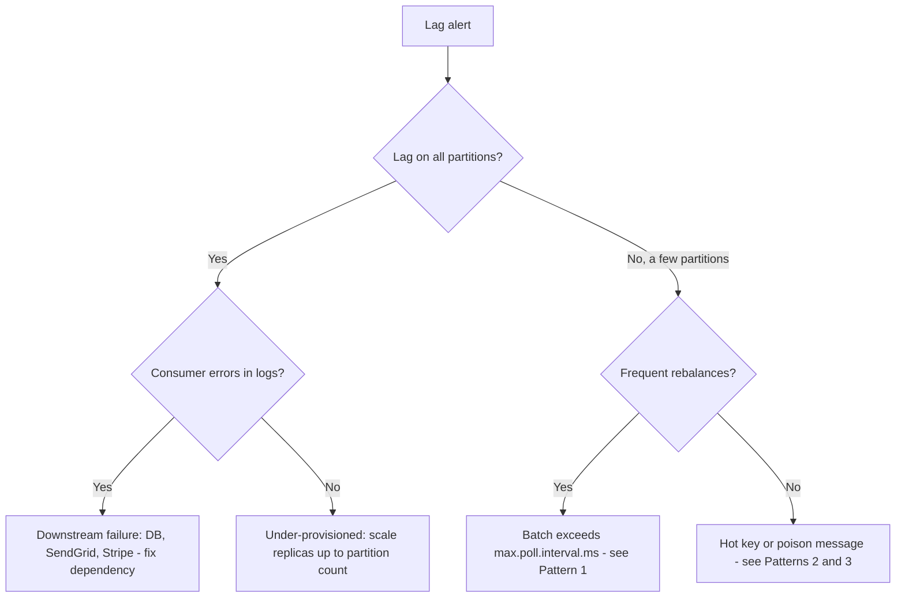

# Runbook: Kafka Consumer Lag

## Overview
Use when PagerDuty fires `<consumer-group> lag > 50k for 10m` or when downstream data (usage meters, notifications) looks stale. Lag means a [Kafka](../entities/kafka.md) consumer group is falling behind producers. The most important first question is whether the lag is **spread evenly** across partitions (capacity problem) or **concentrated** on a few (hot key or a stuck consumer).

## Key Consumer Groups

| Consumer group | Topic | Owner | Impact if lagging |
|---|---|---|---|
| `billing-usage-aggregator` | `usage.events.v1` | Billing | Usage meters & invoices stale ([Usage-Based Billing](../features/usage-based-billing.md)) |
| `notification-dispatch` | `billing.invoice.v1`, `auth.user.v1` | Platform | Delayed emails (receipts, password resets) |
| `billing-user-sync` | `auth.user.v1` | Billing | New accounts can't check out |

## Step 1 — Where is the lag?

Datadog:
```text
max:kafka.consumer_lag{consumer_group:billing-usage-aggregator} by {partition}
```
> [!note]
> `aws.kafka.max_offset_lag` (from MSK) is ~1 minute delayed. Prefer `kafka.consumer_lag` from the in-cluster exporter.

Kafka UI:
```bash
kubectl -n platform port-forward svc/kafka-ui 8081:80
# open http://localhost:8081 -> Consumers -> <group>
```



## Step 2 — Check for rebalance loops

```bash
kubectl -n billing logs -l app=billing-service --since=30m \
  | grep -E "rebalanc|max.poll.interval|slow batch" | tail -50
```

A loop looks like:
```text
WARN [UsageAggregator] slow batch: partition=7 size=500 took=48211ms
INFO [Consumer] group rebalancing ... reason: member left (max.poll.interval.ms exceeded)
```

## Known Patterns

### Pattern 1 — Rebalance loop (batch slower than poll interval)
A batch takes longer than `max.poll.interval.ms`, the consumer is evicted, partitions move to another pod, which replays the same slow batch and is evicted too. Lag grows without errors.

**Mitigate** (configmap, then restart):
```yaml
KAFKA_MAX_POLL_INTERVAL_MS: "300000"   # was 30000
KAFKA_MAX_POLL_RECORDS: "100"          # was 500
```
```bash
kubectl -n billing rollout restart deploy/billing-service
```

### Pattern 2 — Hot partition from a hot key
Topics are keyed by `account_id`, so one very active tenant lands on one partition. On 2026-09-27, a single enterprise trial sent ~40× normal volume to partition 7, and per-event `SELECT ... FOR UPDATE` upserts on the same `usage_meter` row serialised processing.

**Fix:** pre-aggregate in memory per `(account, meter, minute)` within a batch so there's one upsert per bucket (billing#2218). Scaling replicas does **not** help — one partition is consumed by at most one pod.

### Pattern 3 — Poison message
One message throws on every attempt. Logs show the same offset repeatedly. Consumers should route failures to `<topic>.dlq` after 5 attempts; if one isn't, skip it manually only with the owning team's approval:
```bash
kafka-consumer-groups --bootstrap-server $MSK_BOOTSTRAP --group <group> \
  --topic <topic>:<partition> --reset-offsets --to-offset <offset+1> --execute
```
> [!warning]
> Resetting offsets drops data for billing topics. Record the skipped offset in the incident channel so it can be replayed.

## Verify Recovery
- Per-partition lag trending to 0 in Datadog.
- No rebalance log lines for 15 minutes.
- For usage: spot-check `usage_meter.updated_at` for the affected account is recent.

## Related Concepts & Dependencies
- [Kafka](../entities/kafka.md)
- [Billing Service](../entities/billing-service.md), [Notification Service](../entities/notification-service.md)
- [Usage-Based Billing](../features/usage-based-billing.md)
- [Transactional Outbox](../concepts/transactional-outbox.md)

## Change History & Superseded Decisions
- **2026-10-01**: Created from Marcus's on-call notes (`raw/debug-sessions/2026-09-27-marcus-kafka-consumer-lag.md`). `max.poll.interval.ms` default for billing consumers raised from 30 s to 300 s; open follow-up to alert on per-partition lag skew.
