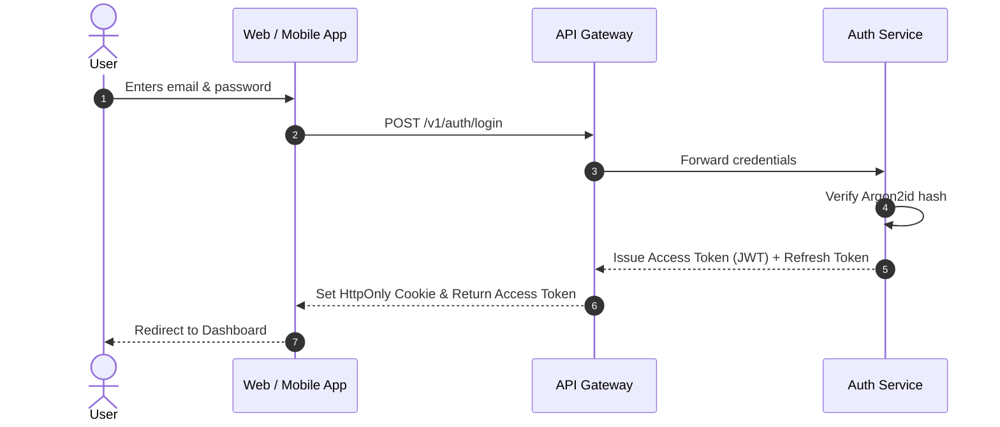

# User Login Flow

## Overview
Describes the end-to-end journey of a user logging into the application, from client credentials submission to JWT verification.

## Sequence Diagram

## Relevant Services & Concepts
- Primary Service: [Auth Service](../entities/auth-service.md)
- Architectural Constraints: [Service Boundaries](../concepts/service-boundaries.md)

## Change History
- **2026-10-01**: Flow formalized during wiki bootstrap.
